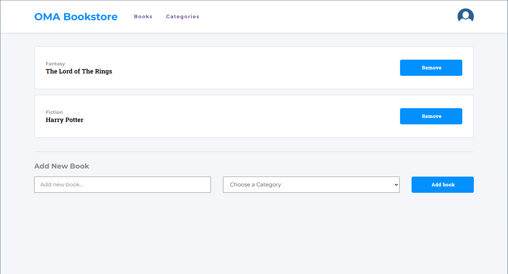

# OMA Bookstore

> The Bookstore is an app built with React and Redux and has two pages books(home page) and categories(under construction). Its MVP (Minimum Viable Product) version of it that allows you to:
- Display a list of books.
- Add a book.
- Remove a selected book

## Live Demo

Deployed [Link](https://oma-bookstore.netlify.app/) using netlify.

## Screenshots

## Built With

- React.
- Redux
- JavaScript.
- CSS.
- Linters.

## Install

- Install node.js from [HERE](https://nodejs.org/en/).

## Test

- `Npm run test`
  
## Setup

1. Clone the project using git-bash or Githup Desktop.
2. Open the project folder with VSCode or any Editor.
3. Open terminal and navigate to the project folder.
4. Type `npm install`.
5. Type `npm start`.

## Authors

👨‍💻 **Omar Muhammad**

- GitHub: [@Omar-Muhamad](https://github.com/Omar-Muhamad)
- Twitter: [@Eng_OmarMuhamad](https://twitter.com/Eng_OmarMuhamad)
- LinkedIn: [@eng-omarmuhammad](https://www.linkedin.com/in/eng-omarmuhammad/)

## Show your support

Give a ⭐️ if you like this project!
## 📝 License

This project is [MIT](./MIT.md) licensed.
